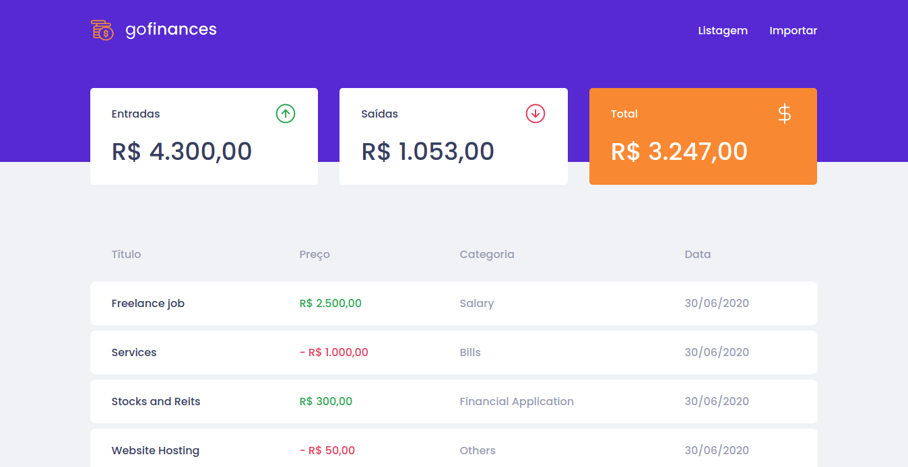
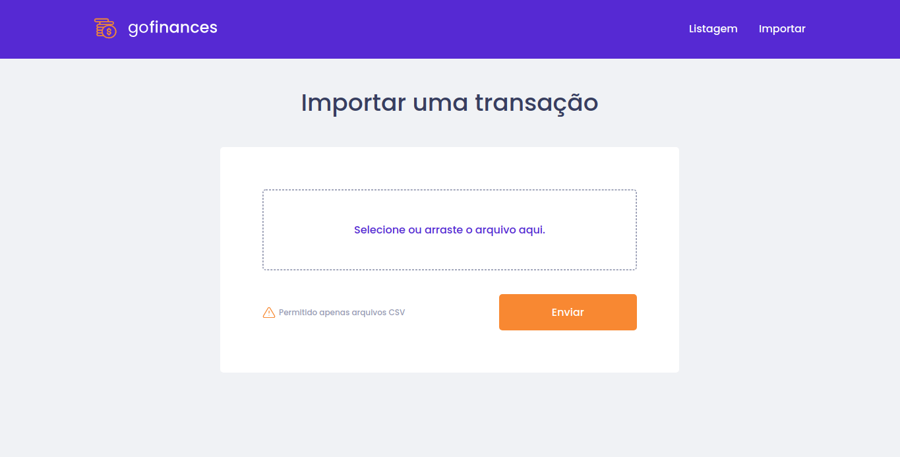

<h1 align="center">Challenge #7 - Go Finances: Web - Rocketseat bootcamp GoStack</h1>

<h2>:computer: About</h2>
The purpose of this project is to complete the #7 Challenge of the Rocketseat GoStack 12 Bootcamp!<br>
https://github.com/Rocketseat/bootcamp-gostack-desafios/tree/master/desafio-fundamentos-reactjs

---


<br>


---

<h2>:computer: What is supposed to do?</h2>
This challenges consists in create a web app (finances app) using React, capable of list all transactions storaged in a database/api, showing incomes, outcomes and totals. It also is capable of import a .CSV file containing financial info.
<ul>
<li>Should be able to list the total balance inside the cards</li>
<li>Should be able to list the transactions</li>
<li>Should be able to navigate to the import page</li>
<li>Should be able to upload a file</li>
</ul>

---

<h2>:toolbox: What did I use?</h2>

- [React](https://reactjs.org/)
- [Axios](https://github.com/axios/axios/)
- [TypeScript](https://www.typescriptlang.org/)

<small>The tests were provided by rocketseat staff!</small>

---

<h2>:heavy_check_mark: Check the project</h2>

#### Running the project
```bash
# Step 1 (clone the repository):

$ git clone https://github.com/victorfclima/go-finances-web.git

# Step 2 (install the dependencies):

$ yarn

# Step 3 (run the database):

https://github.com/victorfclima/go-finances-database

# Step 4 (Initialize web app):

$ yarn start
```
